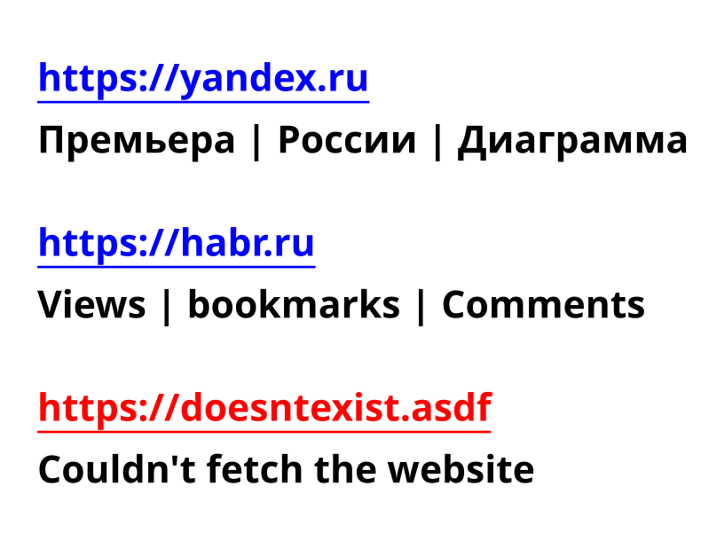

# Тестовое задание №1 для backend стажировки в IT-компании Lad

## [Описание задачи](https://hibrain.ru/news/zadachi-dlya-backend-stazhirovki)
## Решение:
Приложение имеет POST роут `/urls` который принимает список urlов и возвращает pdf в котором для каждой веб-страницы написаны 3 самых встречаемых слова на ней.

## Старт приложения:
Установка зависимостей
```console
$ npm ci
```
Запуск
```console
$ npm start
```

### или можно запустить через [docker](https://docker.com)
Создание docker образа из `Dockerfile`
```console
$ docker build . -t url-parser
```
Запуск контейнера
```console
$ docker run -p 3000:3000 --name url-parser -d url-parser
```

## Пример использования:
```console
curl -X POST \
-H 'Content-Type: application/json' \
-d '{ "urls": ["https://yandex.ru", "https://habr.ru", "https://doesntexist.asdf", "https://twitch.tv"] }' \
http://localhost:3000/ > urls.pdf
```
Pdf файл сохранился в `urls.pdf`

